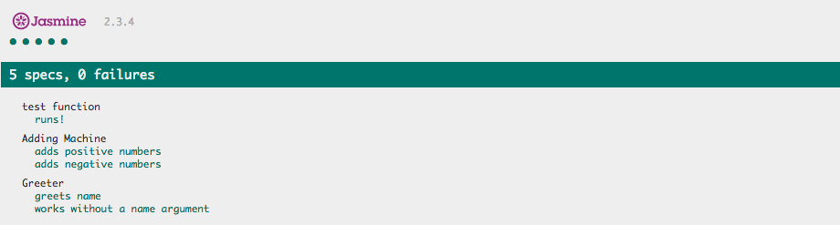

# Jasmine Testing Framework

Jasmine is a tool for testing JavaScript. Here are a few simple examples of how to write tests for functions. In order to run these test on your own machine, you'll need to download [Jasmine](http://jasmine.github.io/2.3/introduction.html) and correct the path references to point to your copy.

### The Files

* [play.js] Contains a few JavaScript functions to test
* [spec.js] Contains the tests write for play.js
* [SpecRunner.html] This file connects the pieces and displays a report

